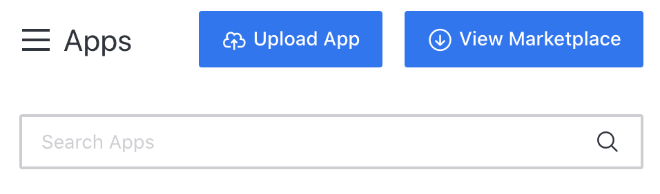
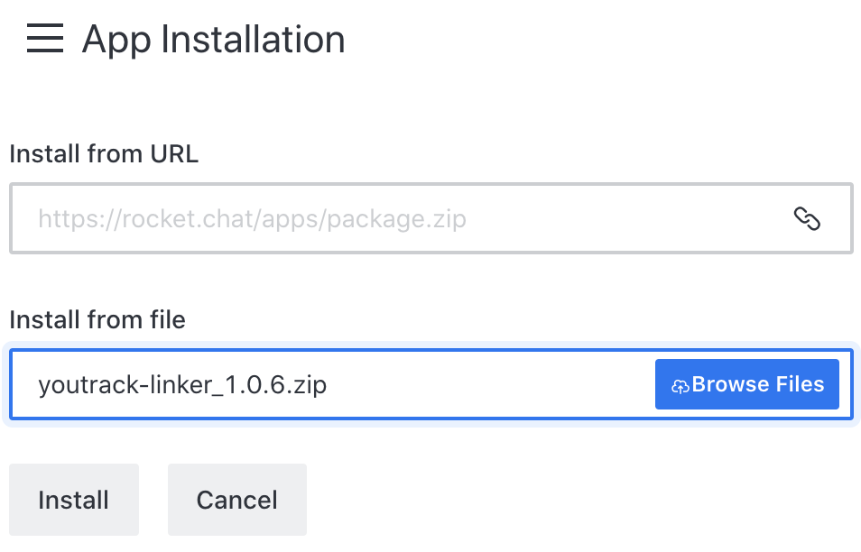
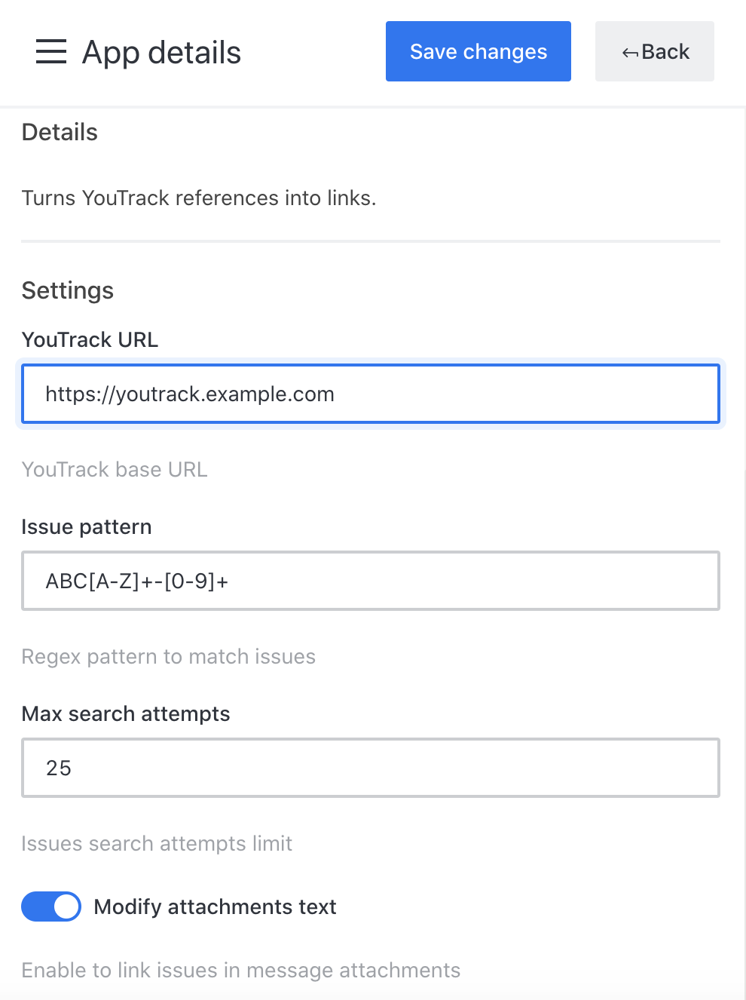

[](https://github.com/zakhar-petrov/rocketchat-youtrack-linker/actions?query=workflow%3Abuild)
[](https://coveralls.io/github/zakhar-petrov/rocketchat-youtrack-linker?branch=refs/heads/master)
[](LICENSE?raw=true)

- [Installation](#installation)
  - [Using Administration page](#using-administration-page)
  - [Using command line](#using-command-line)
- [Settings](#settings)
- [License](#license)

# YouTrack Linker
RocketChat App to turn YouTrack references into links.

## Installation
Enable Apps development mode by navigating to `Administration > General` then scroll down to Apps and click on the True radio button over the Enable development mode.

### Using Administration page
Download ZIP archive `youtrack-linker_<version>.zip` from [latest release](https://github.com/zakhar-petrov/rocketchat-youtrack-linker/releases/latest).

Open `Administration > Apps` and press `Upload App` button.



Browse downloaded ZIP file and press `Install`.



### Using command line
Make sure that you have Node already installed on your machine. Once you have installed Node, run the following command in your terminal to install `rc-apps` globally:
```
npm install -g @rocket.chat/apps-cli
```
Clone repository and run the following command:
```
npm install
```
Now you can deploy the application:
```
rc-apps deploy --url <rocketchat_url>
```
Or update:
```
rc-apps deploy --url <rocketchat_url> --update
```
## Settings
To start using the app you should set YouTrack base URL in the App Administration Page.



## License
The code is available under the [MIT](LICENSE?raw=true) license.
